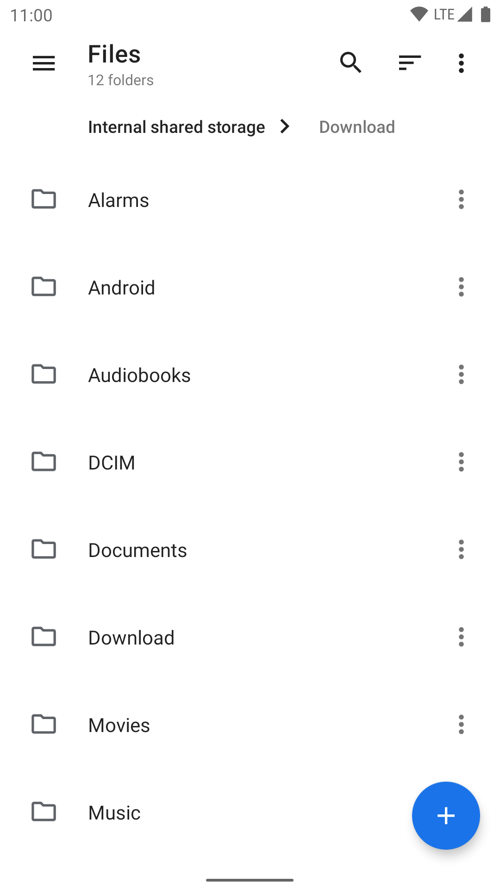
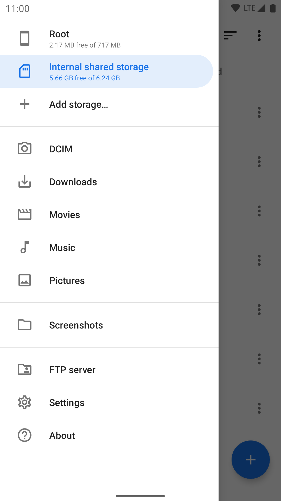
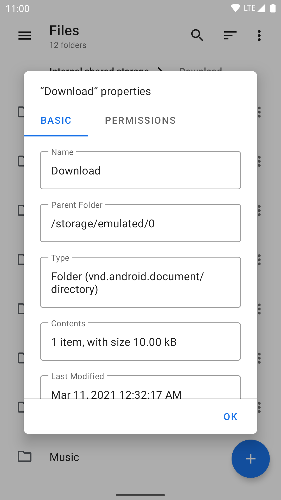
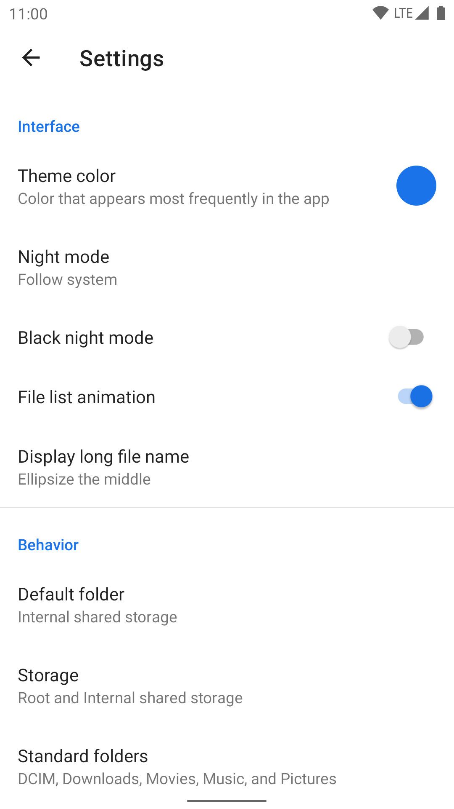
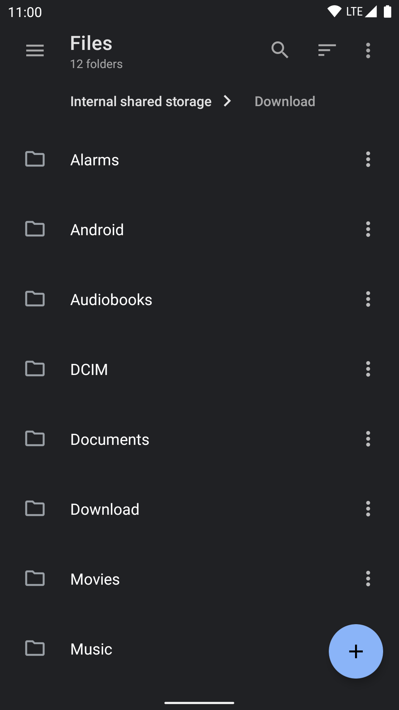
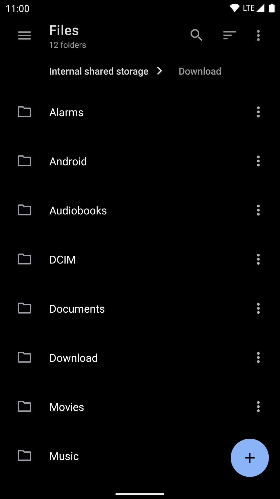

# LeOS FileManager
Material Design file manager for LeOS-GSI

## ⚠ Join us on Telegram (https://t.me/LeOS_Support)

## Preview

  
  

## Features

- Open source: Lightweight, clean and secure.
- Material Design: Follows Material Design guidelines, with attention into details.
- Breadcrumbs: Navigate in the filesystem with ease.
- Root support: View and manage files with root access.
- Archive support: View, extract and create common compressed files.
- NAS support: View and manage files on FTP, SFTP and SMB servers.
- Themes: Customizable UI colors, plus night mode with optional true black.
- Well-implemented: Built upon the right things, including [Java NIO2 File API](https://docs.oracle.com/javase/8/docs/api/java/nio/file/package-summary.html) and [LiveData](https://developer.android.com/topic/libraries/architecture/livedata).

## License

    Copyleft (C) 2023 harvey186

    This program is free software: you can redistribute it and/or modify
    it under the terms of the GNU General Public License as published by
    the Free Software Foundation, either version 3 of the License, or
    (at your option) any later version.

    This program is distributed in the hope that it will be useful,
    but WITHOUT ANY WARRANTY; without even the implied warranty of
    MERCHANTABILITY or FITNESS FOR A PARTICULAR PURPOSE.  See the
    GNU General Public License for more details.

    You should have received a copy of the GNU General Public License
    along with this program.  If not, see <https://www.gnu.org/licenses/>.
